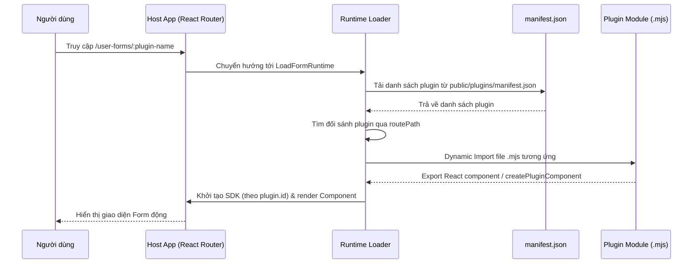

# Hướng dẫn AI & Tổng quan cấu trúc dự án (Mantis Free React Admin Template + Runtime Plugins)

Tài liệu này cung cấp cái nhìn tổng quan về kiến trúc dự án, cấu trúc thư mục, quy trình phát triển và các quy ước kỹ thuật cần tuân thủ dành cho nhà phát triển và các tác nhân AI.

---

## 1. Tổng quan dự án

Dự án là một hệ thống Admin Dashboard được xây dựng trên nền tảng **Mantis Free React Admin Template**, tích hợp kiến trúc **Runtime Plugin Forms**.

Hệ thống được chia làm 2 phần chính:
1. **Host App (Ứng dụng chính - Thư mục gốc):**
   - Đóng vai trò là lớp vỏ (Shell) chứa layout chính, phân quyền, route tĩnh (`/`, `/invoice`, `/bill`), global state (Redux), i18n và theme.
   - Có khả năng tải động (Dynamic Import) các form/mô-đun chức năng ở dạng file `.mjs` tại runtime dựa trên cấu hình khai báo trong `manifest.json`.
2. **Plugin Builder (Trình đóng gói plugin - thư mục `plugin-form-builder/`):**
   - Cho phép phát triển các form/mô-đun độc lập bằng React + TypeScript.
   - Sử dụng **Esbuild** để bundle code nguồn thành định dạng ESM (`.mjs`) độc lập và xuất bản (publish) trực tiếp vào thư mục `public/plugins/` của Host App.

---

## 2. Công nghệ sử dụng (Tech Stack)

- **Framework & Runtime:** React 19, Vite 8, TypeScript (TSX/TS).
- **Giao diện (UI Library):** Material UI (MUI v9), Ant Design Icons (`@ant-design/icons`), Framer Motion (hiệu ứng).
- **Quản lý trạng thái (State Management):** Redux Toolkit (với Redux Saga & Redux Persist), SWR (cho việc quản lý state/cache local).
- **Xử lý Form & Validation:** Formik, React Hook Form, Yup.
- **Quốc tế hóa:** i18next + React i18next.
- **Trình đóng gói phụ trợ:** Esbuild (sử dụng trong `plugin-form-builder`).

---

## 3. Cấu trúc thư mục chi tiết

```text
react-template/ (Host App)
├── .cert/                     # Khóa SSL tự cấp để chạy HTTPS cục bộ (key.pem, cert.pem)
├── public/                    # Thư mục chứa asset tĩnh
│   └── plugins/               # Thư mục lưu trữ tài nguyên plugin chạy động
│       ├── manifest.json      # File cấu hình đăng ký danh sách các plugin hiện có
│       └── *.mjs              # Các file plugin sau khi được biên dịch (VD: demo-form.mjs)
├── src/                       # Source code của ứng dụng chính
│   ├── assets/                # Ảnh, font và style tĩnh
│   ├── components/            # Các UI component dùng chung có tính tái sử dụng cao
│   │   ├── Autocomplete/      # Thành phần Autocomplete tuyển chọn
│   │   ├── Buttons/           # Nút bấm tùy chỉnh
│   │   ├── DataTable/         # Bảng hiển thị dữ liệu nâng cao
│   │   ├── Dialog/            # Hộp thoại modal
│   │   ├── Inputs/            # Các trường nhập liệu tiêu chuẩn
│   │   ├── MainCard.tsx       # Component khung bao bọc (Card) chuẩn của template
│   │   ├── Loader.tsx         # Hiệu ứng tải trang (Spinner/Progress)
│   │   └── Snackbar.tsx       # Hiển thị thông báo Toast nhanh
│   ├── contexts/              # Các Context API (ConfigContext, Theme...)
│   ├── hooks/                 # Custom React Hooks dùng chung (useForm, useLocalStorage...)
│   ├── i18n/                  # Cấu hình đa ngôn ngữ (vi, en...)
│   ├── layout/                # Layout của hệ thống (MainLayout gồm Header, Drawer, Footer)
│   ├── menu-items/            # Khai báo cấu trúc sidebar menu của Admin
│   ├── pages/                 # Các trang tĩnh được định nghĩa sẵn
│   │   ├── auth/              # Các trang Login, Register...
│   │   └── main/              # Các trang chính như Home, Bill, Invoice...
│   ├── routes/                # Cấu hình định tuyến (React Router)
│   ├── runtime/               # Engine chạy plugin động (Plugin Loader, SDK, Declarations)
│   │   ├── LoadFormRuntime/   # Component xử lý tải plugin & render dynamic component
│   │   ├── AppPlugin.tsx      # Điểm đăng ký và map `plugin.id` với SDK Runtime tương ứng
│   │   ├── services/          # Các service hỗ trợ runtime
│   │   └── types/             # Định nghĩa SDK và API được cung cấp cho plugin (MUI, utils, components)
│   ├── store/                 # Cấu hình Redux Store, Middleware, Root Saga
│   ├── themes/                # Định nghĩa theme tùy chỉnh cho Material UI
│   ├── types/                 # Các TypeScript interface dùng chung toàn app
│   └── utils/                 # Các hàm tiện ích dùng chung (format, helper...)
│
└── plugin-form-builder/       # Workspace phát triển & build plugin động độc lập
    ├── src/
    │   └── plugins/           # Chứa source code của từng plugin (mỗi plugin là 1 folder)
    │       ├── demo-form/     # Plugin mẫu mặc định
    │       └── ...
    ├── scripts/               # Các script build, watch và publish plugin
    ├── dist/                  # Output file sau khi build (các file .mjs tạm thời)
    └── package.json           # Danh sách các script build của builder
```

---

## 4. Cơ chế hoạt động của Runtime Plugin



Để một Plugin Module được xem là hợp lệ, nó phải xuất bản (export) theo một trong hai cách:
1. `export default`: Trả về một React Component trực tiếp.
2. `export const createPluginComponent`: Một factory function nhận vào `sdk` và trả về một React Component.

---

## 5. Quy tắc và Quy ước kỹ thuật bắt buộc

### 5.1 Quy ước tự động Reset Form (`useFormActions`)
Hệ thống sử dụng custom hook `useFormActions` (`src/hooks/useForm.ts`) để hỗ trợ reset form tự động khi đóng tab dựa vào tên action của Redux, tránh việc phải hard-code. Để cơ chế này hoạt động chính xác, khi tạo mới một Redux Form Slice, bạn phải tuân thủ nghiêm ngặt quy ước sau:

1. **`name` của slice** phải đặt trùng khớp với dạng chữ thường của `IFormKey` tương ứng:
   ```ts
   // Ví dụ với IFormKey.BILL (giá trị là 'BILL')
   name: IFormKey.BILL.toLowerCase() // -> 'bill'
   ```
2. **Reducer dùng để reset** trong slice phải được đặt tên theo quy tắc `reset[Key]Form` (dạng PascalCase đối với phần Key):
   ```ts
   reducers: {
     resetBillForm: (state) => {
       state.formData = initialState.formData;
     }
   }
   ```
Khi đó, lệnh `resetForm(IFormKey.BILL)` sẽ tự động tạo và dispatch action type: `bill/resetBillForm`.

### 5.2 Phát triển Plugin mới
Khi tạo một plugin mới, hãy đảm bảo tuân thủ các bước:
1. **Tạo mã nguồn:** Đặt tại `plugin-form-builder/src/plugins/<tên-plugin>/index.tsx`.
2. **Sử dụng SDK:** Hạn chế import trực tiếp từ các thư viện ngoài. Hãy ưu tiên sử dụng các component và API được tiêm (inject) qua `sdk` (ví dụ: `const { Box, Typography } = sdk.components;`).
3. **Build & Publish local:** Chạy các lệnh đóng gói để kiểm tra.
4. **Khai báo Manifest:** Thêm đầy đủ thông tin định tuyến vào `public/plugins/manifest.json`.

---

## 6. Các câu lệnh thông dụng

### Dành cho Host App (Thư mục gốc)
* Cài đặt dependencies:
  ```bash
  yarn install
  ```
* Chạy Dev Server (Vite) tại địa chỉ `http://localhost:2210` (hoặc HTTPS nếu có cert):
  ```bash
  yarn start
  ```
* Kiểm tra lỗi cú pháp (Linting):
  ```bash
  yarn lint
  ```
* Type-check và Build ứng dụng Host chính thức:
  ```bash
  yarn build
  ```

### Dành cho Plugin Builder (`plugin-form-builder/`)
* Đi tới thư mục builder:
  ```bash
  cd plugin-form-builder
  ```
* Biên dịch một plugin cụ thể (mặc định: `demo-form`):
  ```bash
  yarn build [tên-plugin]
  ```
* Tự động biên dịch lại khi file thay đổi:
  ```bash
  yarn watch [tên-plugin]
  ```
* Đẩy file `.mjs` đã biên dịch sang thư mục `public/plugins/` của Host:
  ```bash
  yarn publish:local [tên-plugin]
  ```
* Biên dịch toàn bộ các plugin có trong thư mục `src/plugins/`:
  ```bash
  yarn build:all
  ```

---

## 7. Khắc phục sự cố nhanh (Troubleshooting)

| Lỗi thường gặp | Nguyên nhân phổ biến | Cách khắc phục |
|---|---|---|
| **`Cannot load plugin manifest`** | File `manifest.json` không tồn tại, sai cú pháp JSON hoặc lỗi cổng mạng. | Kiểm tra file tại `public/plugins/manifest.json`. Xem lại biến cấu hình `VITE_PLUGIN_MANIFEST_URL`. |
| **`No plugin found for route...`** | Chưa khai báo plugin trong manifest hoặc trường `routePath` bị sai lệch. | Kiểm tra thuộc tính `routePath` trong manifest xem có khớp với URL đang mở không, đảm bảo `enabled: true`. |
| **`Plugin <id> has no valid exported component`** | Plugin không export đúng chuẩn `default` hoặc `createPluginComponent`. | Kiểm tra file nguồn của plugin. Mở file `.mjs` sau khi build để đảm bảo phần export hợp lệ. |
| **Plugin hiển thị không đúng giao diện/SDK** | Chưa định cấu hình map SDK cho Plugin ID mới nên hệ thống fallback. | Mở file `src/runtime/AppPlugin.tsx` và đăng ký SDK Declaration mới khớp với `id` của plugin. |
