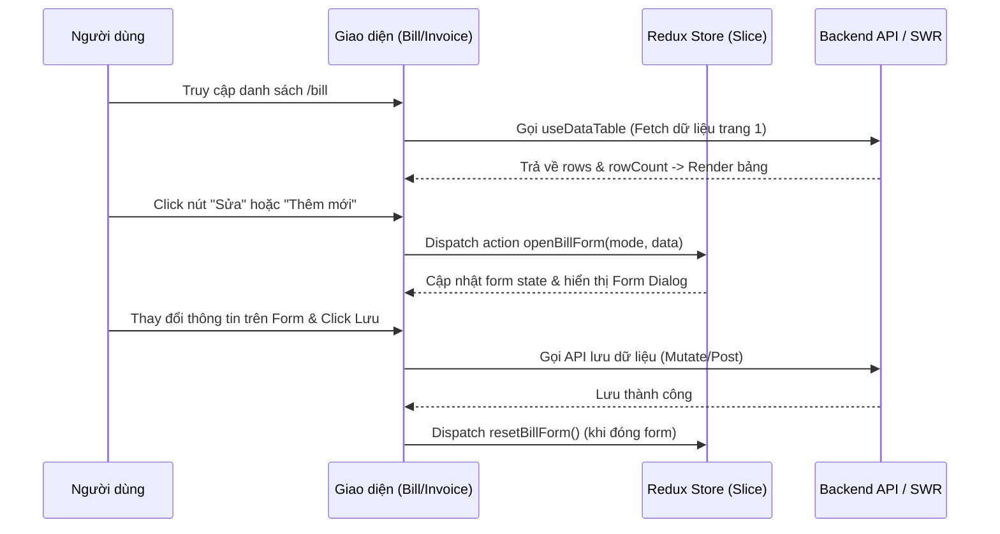

# React Template + Runtime Plugin Forms (Mantis Admin Dashboard)

Dự án này là một hệ thống Admin Dashboard được xây dựng trên nền tảng **Mantis Free React Admin Template**, tích hợp kiến trúc **Runtime Plugin Forms** linh hoạt, cho phép tải động và thực thi các form chức năng được viết bằng React + TypeScript dưới dạng file `.mjs` tại runtime.

Tài liệu này cung cấp chi tiết về kiến trúc hệ thống, yêu cầu và luồng xử lý dữ liệu của từng mô-đun, cách triển khai Redux slice/hook theo đúng quy ước, cùng các hướng dẫn kỹ thuật quan trọng khác.

---

## Bản đồ Tài liệu Dự án (Project Documentation Map)

Dưới đây là danh sách các tài liệu hướng dẫn phát triển và quy tắc kỹ thuật có trong dự án:

* **[README.md](file:///Volumes/KINGSTON/Code/react-template/README.md)** (Tài liệu này): Tổng quan về kiến trúc dự án, yêu cầu xử lý dữ liệu, luồng nghiệp vụ tĩnh & động và hướng dẫn chi tiết cách triển khai Redux slices/hooks.
* **[docs/project_rules.md](file:///Volumes/KINGSTON/Code/react-template/docs/project_rules.md)**: Quy tắc lập trình bắt buộc đối với Redux, UI Components & Styling, DataTable (MUI DataGridPro), cơ chế tự động Reset Form và quy tắc giao tiếp chéo tab bằng BroadcastChannel.
* **[docs/agents.md](file:///Volumes/KINGSTON/Code/react-template/docs/agents.md)**: Hướng dẫn dành cho AI Agents & Nhà phát triển mới, giải thích cấu trúc thư mục chi tiết, cơ chế hoạt động của Runtime Plugin, xử lý form reset và các câu lệnh thông dụng.
* **[docs/email_system.md](file:///Volumes/KINGSTON/Code/react-template/docs/email_system.md)**: Hướng dẫn kỹ thuật cho hệ thống soạn thảo email nổi (Gmail-style Multi-composer), cơ chế tối ưu hiệu năng tránh render lại DOM bằng Global Map Cache ngoài Redux.
* **[docs/project_development_skill.md](file:///Volumes/KINGSTON/Code/react-template/docs/project_development_skill.md)**: Hướng dẫn quy trình phát triển chi tiết, cách đồng bộ hóa React Hook Form với Redux sử dụng `useReduxFormSync`, và cách hoạt động của DataTable.
* **[docs/recaptcha_v3.md](file:///Volumes/KINGSTON/TAVICO/erp-res/docs/recaptcha_v3.md)**: Hướng dẫn kỹ thuật và cơ chế hoạt động của Google reCAPTCHA v3 tích hợp trong Frontend và cách xác thực chéo phía Backend API Server.


---

## 1. Kiến trúc dự án (Project Architecture)

Hệ thống được chia làm hai khu vực làm việc (workspaces) độc lập:

```mermaid
graph LR
    subgraph Host App (Shell)
        A[App chính - Vite + React 19]
        B[Redux Store / Global State]
        C[Runtime Loader Engine]
        D[Router tĩnh: /, /bill, /invoice]
    end
    
    subgraph Plugin Builder
        E[Workspace độc lập: TS + ESBuild]
        F[Source code plugins]
    end
    
    F -->|ESBuild compile| G[File *.mjs]
    G -->|Publish| H[public/plugins/]
    C -->|Fetch| I[manifest.json]
    C -->|Dynamic import| G
```

### 1.1 Host App (Ứng dụng chính - Thư mục gốc)
- **Vai trò**: Đóng vai trò là lớp vỏ (Shell) chứa layout chính, cơ chế phân quyền, hệ thống định tuyến tĩnh (`/`, `/invoice`, `/bill`), global state (Redux), đa ngôn ngữ (i18n) và theme.
- **Động cơ chạy Plugin (Runtime Engine)**: Khi người dùng truy cập một route động (ví dụ `/user-forms/customer-form`), component `LoadFormRuntime` sẽ tải cấu hình từ `manifest.json`, kiểm tra xem plugin có tồn tại và được kích hoạt hay không, sau đó tiến hành tải động (Dynamic Import) file `.mjs` tương ứng.
- **SDK Runtime**: Host app khởi tạo và tiêm (inject) một đối tượng `sdk` vào plugin. SDK này chứa các component dùng chung (MUI components, DataTable, Dialog, Inputs...) và các hàm tiện ích để plugin có thể sử dụng mà không cần đóng gói trực tiếp, giúp giảm dung lượng file plugin.

### 1.2 Plugin Builder (Trình đóng gói plugin - thư mục `plugin-form-builder/`)
- **Vai trò**: Cho phép phát triển các form/mô-đun độc lập bằng React + TypeScript.
- **Công cụ đóng gói (Bundler)**: Sử dụng **Esbuild** để compile và đóng gói mã nguồn thành định dạng ESM (`.mjs`) độc lập, tự động loại bỏ các thư viện đã có sẵn ở Host App (externalize React, MUI, etc.) và xuất bản trực tiếp vào thư mục `public/plugins/` của Host App.

### 1.3 Cấu trúc thư mục dự án (Project Structure)

```text
react-template/ (Host App - Thư mục gốc)
├── .cert/                     # Khóa SSL tự cấp để chạy HTTPS cục bộ (key.pem, cert.pem)
├── public/                    # Thư mục chứa asset tĩnh
│   └── plugins/               # Thư mục lưu trữ tài nguyên plugin chạy động
│       ├── manifest.json      # File cấu hình đăng ký danh sách các plugin hiện có
│       └── *.mjs              # Các file plugin sau khi được biên dịch (VD: demo-form.mjs)
├── src/                       # Source code của ứng dụng chính
│   ├── assets/                # Ảnh, font và style tĩnh
│   ├── components/            # Các UI component dùng chung có tính tái sử dụng cao
│   │   ├── Autocomplete/      # Thành phần Autocomplete tuyển chọn
│   │   ├── Buttons/           # Nút bấm tùy chỉnh
│   │   ├── DataTable/         # Bảng hiển thị dữ liệu nâng cao
│   │   ├── Dialog/            # Hộp thoại modal
│   │   ├── Inputs/            # Các trường nhập liệu tiêu chuẩn
│   │   ├── MainCard.tsx       # Component khung bao bọc (Card) chuẩn của template
│   │   ├── Loader.tsx         # Hiệu ứng tải trang (Spinner/Progress)
│   │   └── Snackbar.tsx       # Hiển thị thông báo Toast nhanh
│   ├── contexts/              # Các Context API (ConfigContext, Theme...)
│   ├── hooks/                 # Custom React Hooks dùng chung (useForm, useLocalStorage...)
│   ├── i18n/                  # Cấu hình đa ngôn ngữ (vi, en...)
│   ├── layout/                # Layout của hệ thống (MainLayout gồm Header, Drawer, Footer)
│   ├── menu-items/            # Khai báo cấu trúc sidebar menu của Admin
│   ├── pages/                 # Các trang tĩnh được định nghĩa sẵn
│   │   ├── auth/              # Các trang Login, Register...
│   │   └── main/              # Các trang chính như Home, Bill, Invoice...
│   ├── routes/                # Cấu hình định tuyến (React Router)
│   ├── runtime/               # Engine chạy plugin động (Plugin Loader, SDK, Declarations)
│   │   ├── LoadFormRuntime/   # Component xử lý tải plugin & render dynamic component
│   │   ├── AppPlugin.tsx      # Điểm đăng ký và map `plugin.id` với SDK Runtime tương ứng
│   │   ├── services/          # Các service hỗ trợ runtime
│   │   └── types/             # Định nghĩa SDK và API được cung cấp cho plugin (MUI, utils, components)
│   ├── store/                 # Cấu hình Redux Store, Middleware, Root Saga
│   ├── themes/                # Định nghĩa theme tùy chỉnh cho Material UI
│   ├── types/                 # Các TypeScript interface dùng chung toàn app
│   └── utils/                 # Các hàm tiện ích dùng chung (format, helper...)
│
└── plugin-form-builder/       # Workspace phát triển & build plugin động độc lập
    ├── src/
    │   └── plugins/           # Chứa source code của từng plugin (mỗi plugin là 1 folder)
    │       ├── demo-form/     # Plugin mẫu mặc định
    │       └── ...
    ├── scripts/               # Các script build, watch và publish plugin
    ├── dist/                  # Output file sau khi build (các file .mjs tạm thời)
    └── package.json           # Danh sách các script build của builder
```

---

## 2. Yêu cầu xử lý dữ liệu (Data Processing Requirements)

Hệ thống tuân thủ các nguyên tắc xử lý dữ liệu sau nhằm tối ưu hóa trải nghiệm người dùng và hiệu năng mạng:

1. **Chiến lược Caching với SWR**:
   - Đối với dữ liệu từ xa (`remote` mode), hệ thống sử dụng thư viện `useSWR` để quản lý trạng thái tải, dữ liệu và bộ nhớ đệm (cache).
   - Tắt các tính năng revalidate tự động không cần thiết (`revalidateOnFocus: false`, `revalidateIfStale: false`, `revalidateOnReconnect: false`) nhằm tránh spam request lên server.
   - Sử dụng `keepPreviousData: true` để giữ lại dữ liệu cũ khi lật trang, tránh hiện tượng chớp nháy màn hình.
2. **Bộ nhớ đệm toàn cục (Global Cache)**:
   - Các biến cache ở cấp độ module (như `globalSelectionCache` và `globalDataCache`) được dùng để lưu giữ trạng thái chọn dòng (selection model) và dữ liệu chỉnh sửa cục bộ khi component bị unmount hoặc khi lật trang/chuyển tab, giúp khôi phục trạng thái tức thì khi quay lại.
3. **Lazy Loading & Infinite Scroll**:
   - Đối với các bộ chọn dữ liệu lớn (như Autocomplete), hệ thống sử dụng `useSWRInfinite` để tải dữ liệu theo từng trang nhỏ (ví dụ 7 dòng một trang). Dữ liệu mới sẽ được nối thêm vào mảng cũ (`.flat()`) khi người dùng cuộn xuống đáy danh sách.
4. **Xử lý Dữ liệu Cục bộ (Local Mode)**:
   - Khi bảng hoạt động ở chế độ `local`, hệ thống tự động lọc dữ liệu dựa trên từ khóa tìm kiếm (`keyword`) bằng cách duyệt qua toàn bộ giá trị của các thuộc tính trong dòng dữ liệu một cách không phân biệt chữ hoa/thường (case-insensitive).

---

## 3. Luồng xử lý dữ liệu của mỗi Module (Module Data Flow)

Hệ thống bao gồm hai luồng nghiệp vụ chính đại diện cho hai chế độ vận hành:

### 3.1 Luồng nghiệp vụ Tĩnh (Ví dụ: Bill, Invoice)



1. **Trang danh sách (List Page)**:
   - Sử dụng `DataTable` ở chế độ chỉ xem (`variant: view`, `mode: remote`).
   - SWR tự động tải dữ liệu dựa trên key là sự kết hợp của `page`, `pageSize` và bộ lọc `filters`.
   - Khi thay đổi tìm kiếm hoặc bộ lọc, key của SWR thay đổi sẽ kích hoạt fetch dữ liệu mới.
   - Khi người dùng tick chọn các dòng, danh sách ID được lưu tạm thời vào `globalSelectionCache`.
2. **Trang nhập liệu (Form Page)**:
   - Khi mở form (Thêm mới/Sửa), component dispatch action `openBillForm` để đồng bộ dữ liệu vào Redux Slice.
   - Formik/React Hook Form đảm nhiệm việc quản lý giá trị input cục bộ và validate dữ liệu qua schema Yup.
   - Khi đóng tab hoặc form, hook `useFormActions` được kích hoạt để tự động reset dữ liệu trong slice tương ứng về trạng thái ban đầu, tránh rò rỉ dữ liệu sang lần mở sau.

### 3.2 Luồng nghiệp vụ Động (Runtime Plugins)
1. **Khởi tạo**: Người dùng điều hướng tới `/user-forms/:plugin-name`.
2. **Tải cấu hình**: `LoadFormRuntime` gọi API để lấy nội dung file `public/plugins/manifest.json`.
3. **Nhập module**: Thực hiện `import(moduleUrl)` để tải động file `.mjs` đã biên dịch của plugin.
4. **Tiêm SDK**: Host app lấy cấu hình SDK tương thích với `plugin.id` (khai báo trong `src/runtime/AppPlugin.tsx`) và truyền đối tượng `sdk` này vào hàm khởi tạo plugin.
5. **Render**: Plugin nhận `sdk` để render UI và tương tác với các component của Host App.

---

## 4. Chi tiết cách triển khai một Redux Slice & Hook

Để duy trì cơ chế tự động reset form khi đóng tab hoặc tắt form thông qua hook `useFormActions`, lập trình viên bắt buộc phải tuân thủ nghiêm ngặt quy trình và quy ước đặt tên sau khi triển khai Redux Slice.

### 4.1 Quy tắc đặt tên và Cấu trúc thư mục
Mỗi mô-đun Redux nằm trong thư mục riêng biệt tại `src/store/<module_name>/`:
- `reducer.ts`: Khai báo State, Slice Reducers và Actions.
- `selector.ts`: Khai báo các reselect memoized selectors để component subcribe.

### 4.2 Chi tiết triển khai Redux Slice (`reducer.ts`)

Bắt buộc tuân thủ 2 quy ước sau để hook `useFormActions.resetForm(formKey)` có thể tự động sinh ra action reset chính xác:
1. **`name` của slice**: Phải trùng khớp với dạng chữ thường của `IFormKey` tương ứng (Ví dụ: `IFormKey.BILL` là `'BILL'` -> `name` phải là `'bill'`).
2. **Reducer reset**: Phải đặt tên theo quy tắc `reset[Key]Form` với `Key` viết hoa chữ cái đầu (PascalCase) tương ứng với enum `IFormKey` (Ví dụ: `resetBillForm`).

**Ví dụ mã nguồn mẫu cho Module `BILL`:**
```typescript
import { createSlice, PayloadAction } from '@reduxjs/toolkit';
import { EFormMode } from 'types/form';
import { IFormKey } from 'types';

// 1. Định nghĩa kiểu dữ liệu cho Form và State
export type BillFormData = {
  customerName: string;
  product?: any;
};

export interface IBillState {
  list: {
    activeTab: string;
    searchKeyword: string;
    filters: Record<string, any>;
  };
  form: {
    mode: EFormMode;
    activeId: string | number | null;
    formData: BillFormData;
    loading: boolean;
    saving: boolean;
  };
}

const initialState: IBillState = {
  list: {
    activeTab: 'all',
    searchKeyword: '',
    filters: {},
  },
  form: {
    mode: EFormMode.FORM,
    activeId: null,
    formData: {
      customerName: '',
      product: null,
    },
    loading: false,
    saving: false,
  },
};

// 2. Khởi tạo Slice với quy ước tên bắt buộc
const billSlice = createSlice({
  name: IFormKey.BILL.toLowerCase(), // Bắt buộc: 'bill'
  initialState,
  reducers: {
    updateBillForm: (state, action: PayloadAction<Partial<BillFormData>>) => {
      state.form.formData = { ...state.form.formData, ...action.payload };
    },
    // Bắt buộc: Tên reducer reset phải là resetBillForm
    resetBillForm: (state) => {
      state.form = initialState.form;
    },
  },
});

export const { updateBillForm, resetBillForm } = billSlice.actions;
export default billSlice.reducer;
```

### 4.3 Cách sử dụng Hook Reset trong Component
Khi component form unmount (hoặc khi đóng tab), ta gọi hook `useFormActions` để reset state của form:
```tsx
import { useEffect } from 'react';
import { useFormActions } from 'hooks/useForm';
import { IFormKey } from 'types';

const BillFormContainer = () => {
  const { resetForm } = useFormActions();

  useEffect(() => {
    return () => {
      // Tự động sinh ra và dispatch action: bill/resetBillForm
      resetForm(IFormKey.BILL);
    };
  }, [resetForm]);

  return <FormLayout />;
};
```

## 5. Đồng bộ hóa chéo tab với BroadcastChannel

Hệ thống tích hợp API `BroadcastChannel` cho phép trao đổi dữ liệu chéo tab (ví dụ: tự động đăng xuất các tab khi một tab chọn đăng xuất, đồng bộ theme, v.v.).

### 5.1 Cấu trúc Broadcast Service
Service `src/services/broadcast.ts` quản lý kênh kết nối `app_global_channel` và cung cấp các hàm helper an toàn:
- `createSafeBroadcastChannel()`: Khởi tạo BroadcastChannel an toàn.
- `postBroadcastMessage(type, payload)`: Gửi tin nhắn đi.
- `BroadcastEventTypes`: Danh sách sự kiện được chuẩn hóa (`AUTH_LOGOUT`, `THEME_CHANGE`, v.v.).

### 5.2 Cách sử dụng Hook `useBroadcastChannel` trong React

1. **Vừa lắng nghe vừa gửi message**:
   ```tsx
   import { useBroadcastChannel } from 'hooks';
   import { BroadcastEventTypes } from 'services';

   useBroadcastChannel((message) => {
     if (message.type === BroadcastEventTypes.AUTH_LOGOUT) {
       // Xử lý tự động logout ở tab hiện tại
     }
   });
   ```
2. **Chỉ gửi message (không cần lắng nghe)**: Gọi hook không truyền callback để tránh kích hoạt Event Listener ẩn trên tab hiện tại.
   ```tsx
   import { useBroadcastChannel } from 'hooks';
   import { BroadcastEventTypes } from 'services';

   const { postMessage } = useBroadcastChannel();
   
   const handleLogout = () => {
     postMessage(BroadcastEventTypes.AUTH_LOGOUT);
   };
   ```

### 5.3 Gọi từ dynamic plugins (qua SDK)
Các plugin tải động sử dụng qua SDK thông qua `sdk.broadcast` để giao tiếp với Host App và các tab khác:
- `sdk.broadcast.postMessage(type, payload)`
- `sdk.broadcast.subscribe((message) => { ... })` (Trả về hàm `unsubscribe`)

---

## 6. Các yêu cầu kỹ thuật và Quy trình kiểm tra khác

- **HTTPS cục bộ**: Khi khởi động server ở môi trường local (`yarn start`), ứng dụng sẽ tự động chạy dưới giao thức bảo mật HTTPS nếu phát hiện có khóa SSL tự ký nằm ở thư mục `./.cert/` (`key.pem` và `cert.pem`).
- **Quy trình kiểm tra trước khi Merge**:
  - Tại thư mục gốc: Chạy `yarn lint` để kiểm tra lỗi cú pháp và chạy `yarn build` để kiểm tra lỗi kiểu dữ liệu TypeScript của Host App.
  - Tại thư mục plugin builder: Chạy `cd plugin-form-builder && yarn build:all` để kiểm tra lỗi biên dịch của tất cả các dynamic plugins hiện có.