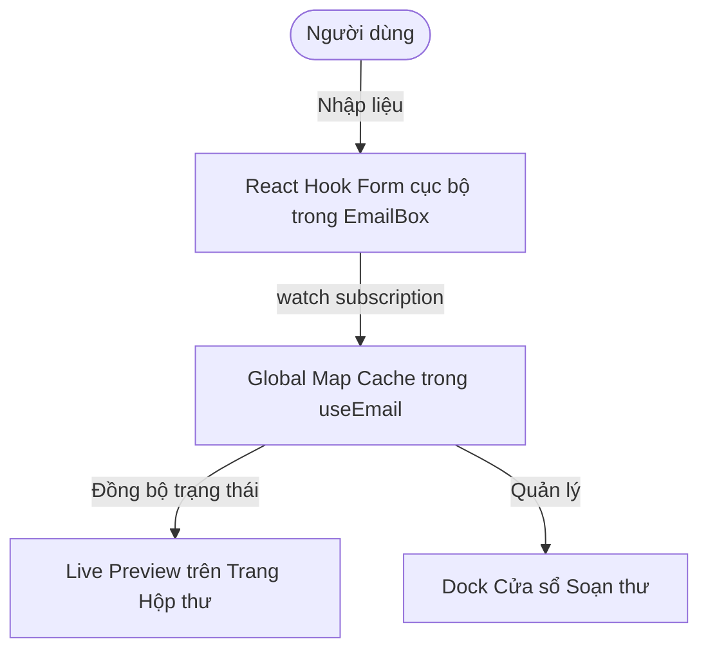

# Tài liệu Kỹ thuật: Hệ thống Soạn thảo Email (EmailBox & useEmail)

Tài liệu này mô tả chi tiết kiến trúc, luồng xử lý dữ liệu và các quy tắc kỹ thuật của hệ thống Soạn thảo Email (Gmail-style Multi-composer) trong dự án.

---

## 1. Kiến trúc Tổng quan (Architecture Overview)

Hệ thống cho phép người dùng soạn thảo nhiều email đồng thời thông qua các cửa sổ nổi (floating windows) ở góc dưới bên phải màn hình. Để tối ưu hiệu năng và tránh re-render toàn bộ ứng dụng khi người dùng gõ phím, hệ thống sử dụng một mô hình lưu trữ hỗn hợp:

- **Global Cache (Bộ nhớ đệm toàn cục ngoài Redux)**: Trạng thái và dữ liệu của tất cả các cửa sổ soạn thảo được lưu trữ trong một đối tượng `Map` ở cấp độ module của file custom hook `useEmail.ts`.
- **Local React Hook Form (Quản lý Form cục bộ)**: Mỗi component `EmailBox` khởi tạo một thực thể `useForm` riêng để quản lý việc nhập liệu, validation và hiển thị tức thời.
- **Two-way Data Sync (Đồng bộ hai chiều)**: Dữ liệu từ React Hook Form được đồng bộ liên tục lên Global Cache qua `watch()` để phục vụ tính năng Live Preview (xem trước email) và khôi phục trạng thái khi đóng/mở/thu nhỏ cửa sổ.



---

## 2. Kiểu dữ liệu & Trạng thái (Data Types & State)

Chi tiết khai báo tại [useEmail.ts](file:///Volumes/KINGSTON/TAVICO/erp-res/src/hooks/useEmail.ts):

### 2.1 `EmailFormFields` (Trường dữ liệu form)
Chỉ chứa các giá trị thực tế của form soạn thảo email, phù hợp làm kiểu Generic cho React Hook Form:
```typescript
export type EmailFormFields = {
  recipient: string;     // Email người nhận
  subject: string;       // Tiêu đề email
  content: string;       // Nội dung soạn thảo (định dạng HTML)
  cc: string;            // Đồng gửi
  bcc: string;           // Gửi ẩn danh
  showCc: boolean;       // Cờ hiển thị ô nhập Cc
  showBcc: boolean;      // Cờ hiển thị ô nhập Bcc
  attachments: File[];   // Danh sách tệp tin đính kèm
};
```

### 2.2 `EmailComposerState` (Trạng thái cửa sổ soạn thảo)
Chứa dữ liệu nhập liệu kèm các metadata quản lý cửa sổ nổi:
```typescript
export type EmailComposerState = {
  id: string;                         // ID định danh duy nhất của composer
  data: EmailFormFields;              // Dữ liệu nhập liệu
  dirtyFields: Record<string, any>;   // Trạng thái chỉnh sửa các trường
  isMinimized: boolean;               // Trạng thái thu nhỏ cửa sổ
};
```

---

## 3. Custom Hook `useEmail`

Hook này quản lý tập hợp các thực thể soạn thảo thông qua `globalEmailCache` (đối tượng `Map`). 

### 3.1 Cơ chế Đăng ký - Lắng nghe (Publisher-Subscriber Pattern)
Để đồng bộ trạng thái giữa các component khác nhau mà không thông qua Redux, hook sử dụng một tập hợp listener (`Set<() => void>`) và một state `tick` để kích hoạt render lại:
```typescript
const globalEmailCache = new Map<string, EmailComposerState>();
let activeComposerId: string | null = null;
const listeners = new Set<() => void>();

const notifyListeners = () => {
  listeners.forEach((listener) => listener());
};
```
Mỗi khi component gọi `useEmail`, nó sẽ tự động đăng ký một hàm tăng giá trị `tick` để ép React cập nhật UI mỗi khi cache Map thay đổi.

### 3.2 Các API được cung cấp
- `composers`: Danh sách tất cả các composer hiện có dưới dạng đối tượng `Record`.
- `activeComposer`: Dữ liệu và trạng thái của composer đang được focus.
- `addComposer(id, initialData)`: Thêm một cửa sổ soạn thảo mới.
- `updateComposer(id, updates)`: Cập nhật dữ liệu hoặc trạng thái thu nhỏ của một composer.
- `removeComposer(id)`: Hủy bỏ và đóng cửa sổ soạn thảo.
- `setActiveComposer(id)`: Thiết lập composer đang được focus/hoạt động.

---

## 4. Component `EmailBox`

Component [EmailBox](file:///Volumes/KINGSTON/TAVICO/erp-res/src/components/EmailBox/index.tsx) chịu trách nhiệm render và xử lý sự kiện cho từng thực thể soạn thảo.

### 4.1 Khởi tạo Form và Đồng bộ dữ liệu
Form được khởi tạo độc lập cho mỗi cửa sổ bằng React Hook Form:
```typescript
const composer = getComposer(id);

const methods = useForm<EmailFormFields>({
  defaultValues: composer?.data,
  resolver: yupResolver(validationSchema),
  mode: 'onBlur',
});
```

Sử dụng `useEffect` lắng nghe các thay đổi trên form cục bộ và đẩy lên cache chung để phục vụ **Live Preview** tức thời trên trang chính:
```typescript
useEffect(() => {
  const subscription = watch((value) => {
    updateComposer(id, {
      data: { ... },
      dirtyFields: methods.formState.dirtyFields,
    });
  });
  return () => subscription.unsubscribe();
}, [id, watch, updateComposer]);
```

### 4.2 Các tính năng chính
1. **Rich Text Editor với TipTap**:
   Nội dung email được soạn thảo thông qua thư viện TipTap Editor tích hợp sẵn các phím tắt và định dạng văn bản nâng cao.
2. **File Attachments**:
   Quản lý danh sách file đính kèm, hỗ trợ loại bỏ các file trùng tên/trùng kích thước, tính toán và định dạng dung lượng file (`KB`, `MB`).
3. **Floating & Inline Variants**:
   - `floating`: Cửa sổ nổi ở góc phải màn hình, hỗ trợ focus, thu nhỏ (minimize) và đóng nhanh.
   - `inline`: Tích hợp hiển thị trực tiếp vào trang, không thu nhỏ.

---

## 5. Quy tắc Phát triển và Tối ưu hiệu năng (Coding Rules)

- **Tránh sử dụng Redux cho Soạn thảo Email**: Không đẩy dữ liệu gõ phím trực tiếp vào Redux store. Tốc độ cập nhật phím của người dùng rất nhanh (high-frequency), việc lưu vào Redux sẽ gây giật lag do kích hoạt render lại toàn bộ DOM lớn.
- **Xử lý `home-mailbox` đặc biệt**: ID `'home-mailbox'` được coi là cửa sổ hộp thư chính tích hợp ở trang chủ. Nó không bao giờ được thiết lập làm `activeComposer` và không hiển thị trên Floating Dock ở góc màn hình.
- **Dọn dẹp tài nguyên**: Khi người dùng ấn gửi (Send) hoặc hủy bản nháp (Discard), bắt buộc phải gọi `removeComposer(id)` và reset form cục bộ về `initialEmailFormFields` để tránh rò rỉ bộ nhớ.
