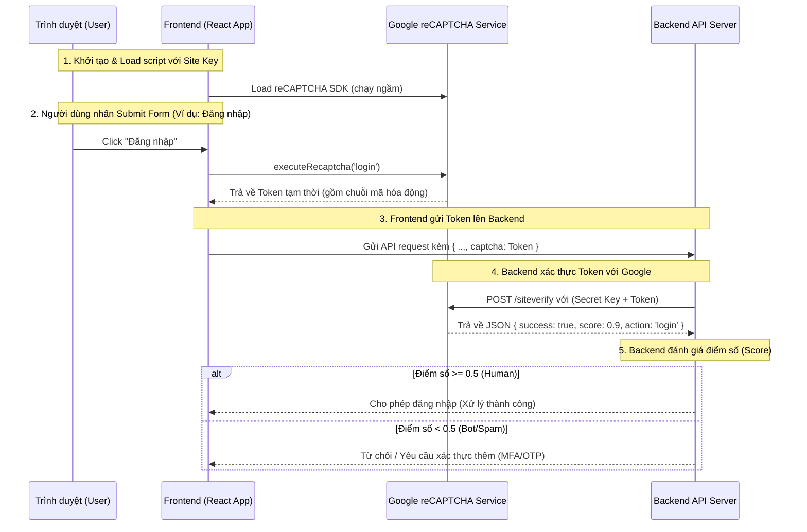

# Hướng dẫn Kỹ thuật và Cơ chế hoạt động của Google reCAPTCHA v3

Tài liệu này giải thích chi tiết cấu trúc tích hợp, cơ chế hoạt động và cách kiểm thử/vận hành Google reCAPTCHA v3 trong dự án để tăng cường bảo mật cho các API xác thực (Đăng nhập, Quên mật khẩu, Đổi mật khẩu).

---

## 1. Cơ chế hoạt động (How it works)

reCAPTCHA v3 hoạt động ẩn danh hoàn toàn (Invisible), không yêu cầu người dùng giải các câu đố phức tạp. Thay vào đó, Google tự động chấm điểm độ tin cậy dựa trên các hành động thực tế của người dùng trên trang.



---

## 2. Quy trình tích hợp trong dự án

### 2.1 Cấu hình Environment (.env)
Thêm Site Key được cung cấp bởi Google reCAPTCHA v3 Admin Console vào file [.env](/.env):
```env
VITE_CAPTCHA_SITE_KEY=your_recaptcha_v3_site_key_here
```

### 2.2 Đăng ký Provider
Provider được cài đặt tại [index.tsx](/src/index.tsx):
```tsx
import { GoogleReCaptchaProvider } from 'react-google-recaptcha-v3';

root.render(
  <Provider store={store}>
    <GoogleReCaptchaProvider reCaptchaKey={siteKey}>
      <AuthProvider ...>
         ...
      </AuthProvider>
    </GoogleReCaptchaProvider>
  </Provider>
);
```

### 2.3 Cách sử dụng tại UI Forms
Sử dụng hook `useGoogleReCaptcha` để lấy hàm sinh token `executeRecaptcha`:

```tsx
import { useGoogleReCaptcha } from 'react-google-recaptcha-v3';
import { login } from 'services';

export default function AuthLogin() {
  const { executeRecaptcha } = useGoogleReCaptcha();

  const handleSubmit = async (values) => {
    let captchaToken = '';
    
    if (executeRecaptcha) {
      try {
        // Sinh token cho action 'login'
        captchaToken = await executeRecaptcha('login');
      } catch (error) {
        console.error('reCAPTCHA execution failed:', error);
      }
    }

    // Gửi token lên API backend
    login({ 
      username: values.username, 
      password: values.password, 
      captcha: captchaToken 
    }, (data) => {
      // Xử lý đăng nhập thành công
    });
  };
}
```

---

## 3. Xác thực tại API Layer (Services)

Các hàm API được định nghĩa trong [src/services/api/authorization.ts](/src/services/api/authorization.ts) đã chấp nhận tham số `captcha` động:
```typescript
const login = (data: {username: string, password: string, captcha?: string}, callback?: (data: any) => void) => {
  return handlePost("", {
    "action": "ConnectDB",
    "method": "getConfig",
    "data": [{
      id: 1,
      username: data.username,
      password: data.password,
      captcha: data.captcha || import.meta.env.VITE_CAPTCHA_SITE_KEY, // Sử dụng captcha động gửi từ UI
    }]
  }, callback);
}
```

---

## 4. Xác thực phía Backend (Server-side Verification)

Sau khi nhận được `captcha` token từ API client, Backend cần gửi một request để kiểm tra chéo với Google:

* **Endpoint:** `https://www.google.com/recaptcha/api/siteverify`
* **HTTP Method:** `POST`
* **Form Parameters:**
  * `secret`: Khóa bí mật (chỉ backend biết).
  * `response`: Token nhận được từ Frontend client.
  * `remoteip` (tùy chọn): Địa chỉ IP của máy khách.

* **Response định dạng JSON:**
  ```json
  {
    "success": true,
    "challenge_ts": "2026-06-16T11:17:44Z",
    "hostname": "localhost",
    "score": 0.9,
    "action": "login"
  }
  ```
  * Backend nên so sánh trường `score` với ngưỡng tin cậy (ví dụ `0.5`). Nếu thấp hơn, nên phản hồi mã lỗi hoặc chặn yêu cầu.
