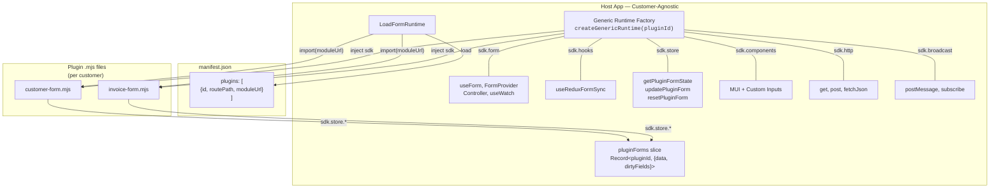
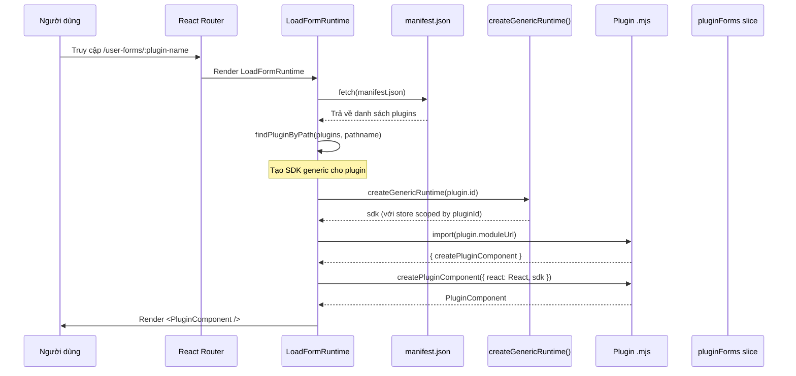
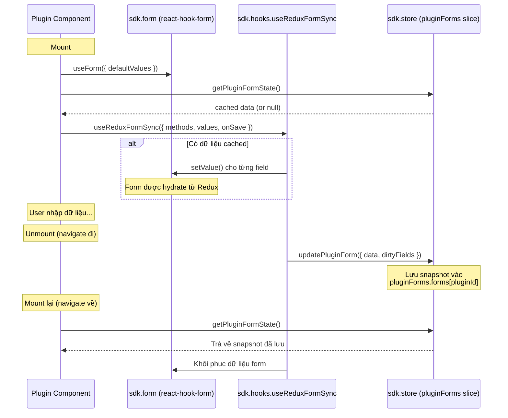

# Runtime Plugin Form — Kiến trúc & Luồng hoạt động

Tài liệu mô tả chi tiết kiến trúc và luồng hoạt động của hệ thống Runtime Plugin Form trong dự án ERP-RES.

---

## 1. Tổng quan kiến trúc

Hệ thống plugin hoạt động theo nguyên tắc **Host cung cấp, Plugin tiêu thụ**:

- **Host App** (customer-agnostic): Cung cấp 1 generic runtime duy nhất chứa tất cả tools, không chứa code riêng cho bất kỳ plugin/khách hàng nào.
- **Plugin `.mjs`** (customer-specific): Hoàn toàn độc lập, tự chứa form logic, validation, API calls. Mỗi khách hàng có bộ plugin riêng.
- **manifest.json** (per deployment): File cấu hình duy nhất khác nhau theo từng triển khai.



---

## 2. Luồng hoạt động chi tiết

### 2.1 Khi người dùng truy cập route plugin



### 2.2 Khi plugin sử dụng form + Redux sync



---

## 3. Cấu trúc file liên quan

### Host App (`src/`)

```text
src/runtime/
├── AppPlugin.tsx              # createAppRuntime(pluginId) — entry point duy nhất
├── LoadFormRuntime/
│   └── index.tsx              # Component load + render plugin
├── services/
│   └── runtime.ts             # getRuntimePluginManifest, loadRuntimePluginComponent
└── types/
    ├── index.ts               # Type definitions (AppRuntime, RuntimeFormApi, RuntimeHooksApi, RuntimePluginStoreApi...)
    └── genericRuntime.ts      # createGenericRuntime() — factory tạo runtime generic

src/store/
└── pluginForms/
    ├── reducer.ts             # Generic slice: updatePluginForm, resetPluginForm, resetAllPluginForms
    └── selector.ts            # selectPluginFormById(pluginId)
```

### Plugin Builder (`plugin-form-builder/`)

```text
plugin-form-builder/
├── src/
│   ├── types.ts               # PluginSdk, PluginFormApi, PluginHooksApi, PluginStoreApi
│   ├── components/            # Shared components dùng chung trong plugin
│   └── plugins/
│       ├── demo-form/
│       │   └── index.tsx      # Plugin mẫu (react-hook-form + Redux sync)
│       └── invoice/
│           └── index.tsx      # Plugin Invoice
├── scripts/
│   ├── build-plugin.mjs       # Esbuild build script
│   └── publish-local.mjs      # Copy .mjs sang public/plugins/
└── dist/                      # Output files (.mjs)
```

---

## 4. SDK API Reference

Mọi API đều được host inject qua `sdk` — plugin **KHÔNG import trực tiếp** từ bất kỳ thư viện nào.

### 4.1 `sdk.components` — UI Components

| Component | Nguồn gốc | Mô tả |
|-----------|-----------|-------|
| `Box` | `@mui/material` | Container layout |
| `Paper` | `@mui/material` | Surface component |
| `Stack` | `@mui/material` | Flex layout |
| `Typography` | `@mui/material` | Text rendering |
| `Button` | Custom | Nút bấm tùy chỉnh |
| `Dialog` | Custom | Hộp thoại modal |
| `MainCard` | Custom | Card container chuẩn |
| `ContainerWrapper` | Custom | Wrapper layout có toolbar |
| `TextField` | Custom | Trường nhập text |
| `NumberField` | Custom | Trường nhập số |
| `DropDownList` | Custom | Dropdown chọn giá trị |
| `DateField` | Custom | Chọn ngày |
| `DateRangeField` | Custom | Chọn khoảng ngày |

### 4.2 `sdk.form` — react-hook-form API

```typescript
const { useForm, FormProvider, Controller, useFormContext, useWatch } = sdk.form;

// Sử dụng giống hệt react-hook-form
const methods = useForm({ defaultValues: { name: '' } });
const { register, handleSubmit, watch } = methods;
```

### 4.3 `sdk.hooks` — Custom Hooks

```typescript
const { useReduxFormSync } = sdk.hooks;

// Đồng bộ form ↔ Redux (persist khi navigate, restore khi quay lại)
useReduxFormSync({
  methods,                    // UseFormReturn từ useForm()
  values: pluginState,        // Data từ Redux
  onSave: (snapshot) => {     // Callback khi unmount
    const { dirtyFields, ...data } = snapshot;
    sdk.store.updatePluginForm({ data, dirtyFields });
  },
  enabled: true,              // Bật/tắt sync (default: true)
  restoreDirtyFields: true,   // Khôi phục dirty state (default: true)
  saveDirtyFields: true,      // Lưu dirty state (default: true)
});
```

### 4.4 `sdk.store` — Redux State (scoped by pluginId)

> **Quan trọng**: Tất cả hàm store đã được **closure pluginId** sẵn. Plugin không cần biết id của mình.

```typescript
// Lấy form state hiện tại (hoặc null nếu chưa có)
const state = sdk.store.getPluginFormState();

// Cập nhật form state
sdk.store.updatePluginForm({
  data: { name: 'John', email: 'john@example.com' },
  dirtyFields: { name: true },
});

// Reset form state (xóa khỏi Redux)
sdk.store.resetPluginForm();

// Truy cập Redux trực tiếp (nếu cần)
const value = sdk.store.useSelector((state) => state.someSlice);
const dispatch = sdk.store.useDispatch();
```

### 4.5 `sdk.http` — HTTP Client

```typescript
const data = await sdk.http.get('/api/customers');
const result = await sdk.http.post('/api/customers', { name: 'John' });
const raw = await sdk.http.fetchJson('/api/data', { method: 'GET' });
```

### 4.6 `sdk.broadcast` — Cross-tab Communication

```typescript
// Gửi message tới các tab khác
sdk.broadcast.postMessage('FORM_SAVED', { id: '123' });

// Lắng nghe message từ các tab khác
const unsubscribe = sdk.broadcast.subscribe((message) => {
  console.log(message.type, message.payload);
});
// Hủy lắng nghe
unsubscribe();
```

---

## 5. Quy trình tạo plugin mới

### Bước 1: Tạo mã nguồn plugin

```bash
mkdir plugin-form-builder/src/plugins/<tên-plugin>
```

```tsx
// plugin-form-builder/src/plugins/<tên-plugin>/index.tsx
import { definePlugin } from '../../types';

type MyFormFields = {
  field1: string;
  field2: number;
};

export const createPluginComponent = definePlugin(({ react: React, sdk }) => {
  const { MainCard, ContainerWrapper, TextField, Button, Stack } = sdk.components;
  const { useForm, FormProvider } = sdk.form;
  const { useReduxFormSync } = sdk.hooks;

  const defaultValues: MyFormFields = { field1: '', field2: 0 };

  function MyPlugin() {
    const methods = useForm({ defaultValues });
    const { register, handleSubmit, watch } = methods;
    const formValues = watch();

    // Lấy và sync state với Redux
    const pluginState = sdk.store.getPluginFormState();
    useReduxFormSync({
      methods,
      values: pluginState,
      onSave: (snapshot) => {
        const { dirtyFields, ...data } = snapshot;
        sdk.store.updatePluginForm({ data, dirtyFields });
      },
    });

    const onSubmit = (data: MyFormFields) => {
      console.log('Submitted:', data);
    };

    return (
      <ContainerWrapper>
        <FormProvider {...methods}>
          <MainCard title="My Plugin Form">
            <Stack spacing={2}>
              <TextField label="Field 1" {...register('field1')} value={formValues.field1} />
              <Button text="Submit" onClick={handleSubmit(onSubmit)} />
            </Stack>
          </MainCard>
        </FormProvider>
      </ContainerWrapper>
    );
  }

  return MyPlugin;
});
```

### Bước 2: Build & Publish

```bash
cd plugin-form-builder
yarn build <tên-plugin>
yarn publish:local <tên-plugin>
```

### Bước 3: Đăng ký Manifest

Thêm vào `public/plugins/manifest.json`:

```json
{
  "id": "<tên-plugin>",
  "name": "Tên hiển thị",
  "routePath": "/user-forms/<tên-plugin>",
  "moduleUrl": "./<tên-plugin>.mjs",
  "enabled": true,
  "icon": "form",
  "sidebar": true
}
```

> **Không cần** thay đổi bất kỳ file nào trong host app. Không cần tạo runtime declaration, không cần đăng ký store, không cần sửa AppPlugin.tsx.

### Bước 4: Kiểm tra

Mở host app → navigate tới `/user-forms/<tên-plugin>`. Plugin sẽ tự động được load và render.

---

## 6. Nguyên tắc thiết kế

| Nguyên tắc | Mô tả |
|------------|-------|
| **Customer-agnostic host** | Host app không chứa code riêng cho bất kỳ plugin/khách hàng nào |
| **Plugin hoàn toàn độc lập** | Mỗi plugin `.mjs` tự chứa toàn bộ form logic, validation, API calls |
| **1 Generic Runtime** | Chỉ có 1 file `genericRuntime.ts` tạo runtime cho mọi plugin |
| **pluginId scoped store** | Redux state được tự động tách biệt theo pluginId qua closure |
| **Không import trực tiếp** | Plugin KHÔNG import `react`, `react-hook-form`, `@mui/material` — tất cả qua `sdk` |
| **manifest.json là config duy nhất** | Thêm/xóa plugin chỉ cần thay file `.mjs` + cập nhật manifest |
