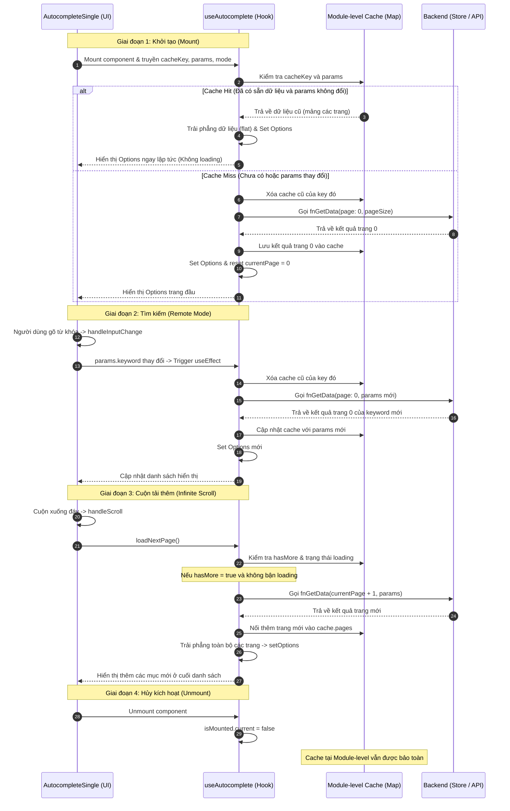

# Phân Tích Cơ Chế Hoạt Động Của Component Autocomplete

Tài liệu này phân tích chi tiết quy trình xử lý dữ liệu, quản lý trạng thái (State), cơ chế bộ nhớ đệm (Cache), vòng đời Mount/Unmount và xử lý bất đồng bộ của component `AutocompleteSingle` kết hợp với custom hook `useAutocomplete`.

---

## 1. Sơ đồ Luồng Dữ Liệu (Data Flow Lifecycle)

Dưới đây là mô hình hoạt động tổng quát của hệ thống Autocomplete từ khi khởi tạo (Mount), xử lý tìm kiếm (Search), cuộn vô hạn (Infinite Scroll) đến khi hủy kích hoạt (Unmount):



---

## 2. Quản Lý Trạng Thái (State & Refs Lifecycle)

Bảng dưới đây mô tả cách lưu trữ dữ liệu và trạng thái trong quá trình hoạt động:

| Biến / Ref | Vị trí định nghĩa | Kiểu dữ liệu | Vai trò & Hành vi |
| :--- | :--- | :--- | :--- |
| `selectedOption` | `AutocompleteSingle` | `any` (Object/String) | **State**: Quản lý giá trị đang được chọn trong ô Input (hỗ trợ cả Controlled & Uncontrolled). |
| `searchKeyword` | `AutocompleteSingle` | `string` | **State**: Lưu từ khóa tìm kiếm khi người dùng gõ vào ô Input (chỉ dùng cho `remote` mode). |
| `options` | `useAutocomplete` | `T[]` | **State**: Chứa danh sách dữ liệu hiển thị trên dropdown listbox. Được đồng bộ từ cache hoặc data tĩnh. |
| `loading` | `useAutocomplete` | `boolean` | **State**: Trạng thái đang tải dữ liệu từ API. Tránh kích hoạt tải trùng lặp. |
| `currentPage` | `useAutocomplete` | `useRef(0)` | **Ref**: Lưu chỉ số trang hiện tại đã được tải (không trigger re-render khi đổi). |
| `isMounted` | `useAutocomplete` | `useRef(true)` | **Ref**: Cờ kiểm tra component còn hiển thị trên DOM hay không. |
| `requestIdRef` | `useAutocomplete` | `useRef(0)` | **Ref**: ID định danh request hiện tại, dùng để giải quyết tranh chấp dữ liệu (Race Condition). |

---

## 3. Cơ Chế Bộ Nhớ Đệm (Module-Level Cache)

Một điểm đặc biệt trong thiết kế của Hook `useAutocomplete` là cơ chế cache nằm ở **phạm vi module**:

```typescript
interface CacheEntry<T> {
  pages: T[][];        // Mảng 2 chiều lưu trữ theo từng trang: [trang 0, trang 1, ...]
  hasMore: boolean;    // Cờ báo hiệu còn dữ liệu ở các trang tiếp theo hay không
  params: string;      // Chuỗi JSON hóa của params truyền vào (để kiểm tra xem có thay đổi bộ lọc không)
}

const cache = new Map<string, CacheEntry<any>>();
```

> [!NOTE]
> Do `cache` được khai báo ngoài hàm hook `useAutocomplete`, nó hoạt động như một biến toàn cục trong phạm vi file (Singleton Pattern). Mọi instance của Autocomplete sử dụng chung một `cacheKey` sẽ chia sẻ chung vùng nhớ cache này.

### Cơ chế kiểm tra thay đổi Params (Cache Validation)
1. Mỗi lần hook chạy lại, nó so sánh chuỗi `JSON.stringify(params)` hiện tại với `cached.params` đã lưu trong cache.
2. **Cache Hit**: Nếu `cacheKey` tồn tại và `params` không thay đổi, dữ liệu được phục hồi trực tiếp từ cache:
   ```typescript
   scheduleOptionsUpdate(cached.pages.flat());
   currentPage.current = cached.pages.length - 1;
   ```
3. **Cache Miss**: Nếu `params` thay đổi (ví dụ: người dùng gõ từ khóa tìm kiếm mới hoặc thay đổi bộ lọc từ store), hệ thống sẽ:
   - Xóa cache cũ: `cache.delete(cacheKey)`.
   - Đặt lại trang hiện tại `currentPage.current = 0`.
   - Gửi yêu cầu API tải trang đầu tiên (`page = 0`).

---

## 4. Chi Tiết Các Hoạt Động Chính

### 4.1. Khởi Tạo & Gán Dữ Liệu Ban Đầu (Mounting)
Khi component được mount:
1. `selectedOption` được khởi tạo thông qua hàm `resolveInitial()`. Nó sẽ ưu tiên nhận `value` từ props truyền vào, nếu không có sẽ lấy `defaultValue`, cuối cùng là `null`.
2. Một hiệu ứng `useEffect` lắng nghe sự thay đổi của props `value` để cập nhật `selectedOption` tương ứng (đồng bộ hóa từ form control bên ngoài).
3. Hook `useAutocomplete` đăng ký sự kiện khởi tạo và gán `isMounted.current = true`.

### 4.2. Xử Lý Bất Đồng Bộ & Chống Cạnh Tranh (Race Condition)
Khi người dùng gõ tìm kiếm rất nhanh, nhiều yêu cầu API sẽ được gửi đi liên tiếp. Do độ trễ mạng khác nhau, kết quả của request gửi trước có thể trả về sau kết quả của request gửi sau, dẫn đến việc hiển thị sai dữ liệu (Stale Data).

Để giải quyết vấn đề này, Hook sử dụng kỹ thuật **Request ID Tracking**:
```typescript
const requestId = ++requestIdRef.current; // Tăng ID mỗi khi gửi request mới

fnGetData(callParams, (result: T[]) => {
  if (!isMounted.current) return;
  if (requestId !== requestIdRef.current) return; // Chỉ chấp nhận callback của request mới nhất
  
  // Xử lý ghi dữ liệu vào state & cache...
});
```

### 4.3. Cuộn Vô Hạn (Infinite Scroll - Lazy Loading)
Quy trình cuộn để tải thêm hoạt động như sau:
1. MuiAutocomplete sử dụng listbox mặc định để chứa các option. Ta bọc sự kiện `onScroll` của listbox này:
   ```typescript
   onScroll: (event: UIEvent<HTMLElement>) => {
     externalListbox.onScroll?.(event);
     handleScroll(event);
   }
   ```
2. Hàm `handleScroll` kiểm tra vị trí thanh cuộn:
   ```typescript
   const isBottom = el.scrollTop + el.clientHeight >= el.scrollHeight - 5;
   if (isBottom && !loading) loadNextPage();
   ```
3. `loadNextPage()` sẽ đọc thông tin cache hiện tại. Nếu `cached.hasMore === true` và trạng thái `loading === false`, nó sẽ tiến hành gọi API cho trang tiếp theo:
   ```typescript
   fetchPage(currentPage.current + 1, true);
   ```
4. Dữ liệu mới tải về sẽ được điền vào vị trí trang tương ứng trong mảng 2 chiều `updatedPages[page] = result`, sau đó hàm `flat()` sẽ gộp tất cả các trang thành một mảng 1 chiều phẳng để gán cho `options`.

### 4.4. Hủy Kích Hoạt & Ngăn Ngừa Lỗi Bộ Nhớ (Unmounting)
Khi component bị gỡ bỏ khỏi giao diện (Unmount/Chuyển trang):
1. Hàm cleanup của `useEffect` trong hook được thực thi:
   ```typescript
   useEffect(() => {
     isMounted.current = true;
     return () => { isMounted.current = false; };
   }, []);
   ```
2. Khi `isMounted.current` trở thành `false`, mọi tác vụ bất đồng bộ chưa hoàn thành (gọi API đang chờ phản hồi, hoặc hàm delay `window.setTimeout`) khi trả về kết quả sẽ bị chặn lại ngay lập tức tại các dòng kiểm tra:
   - `if (!isMounted.current) return;`
3. Điều này ngăn chặn việc thực hiện lệnh `setOptions` hay `setLoading` trên một component đã chết, loại bỏ hoàn toàn lỗi rò rỉ bộ nhớ (Memory Leak) và cảnh báo React đỏ trên console.

### 4.5. Bảo Toàn Trạng Thái (State Preservation)
* **State nội bộ**: Các state như `selectedOption`, `searchKeyword` và `options` (của hook) nằm trong bộ nhớ của React Component nên **sẽ bị hủy hoàn toàn** khi component unmount.
* **Dữ liệu Cache**: Tuy nhiên, toàn bộ dữ liệu đã fetch của các trang (`pages`), cờ `hasMore`, và cấu hình `params` **vẫn được giữ lại** trong bộ nhớ RAM nhờ đối tượng `cache` (Map ở module level).
* **Khi quay lại trang (Remounting)**:
  - Nếu người dùng quay lại trang chứa Autocomplete này, hook `useAutocomplete` được gọi lại với cùng `cacheKey` và `params`.
  - Nhờ cơ chế kiểm tra cache, nó nhận diện được dữ liệu đã tải trước đó (Cache Hit).
  - Nó lập tức gán `options` bằng `cached.pages.flat()` và thiết lập trang hiện tại `currentPage.current = cached.pages.length - 1`.
  - Người dùng thấy danh sách hiển thị ngay lập tức mà **không cần chờ API tải lại**, mang lại trải nghiệm cực kỳ mượt mà.

---

## 5. Đánh Giá Ưu & Nhược Điểm & Lưu Ý Quan Trọng

### 5.1. Ưu Điểm (Pros)
* **Chia sẻ Cache thông minh**: Giảm số lượng request dư thừa lên Server. Nhiều component Autocomplete dùng chung một bộ dữ liệu (như Danh mục Quốc gia, Danh sách Phòng ban) có thể dùng chung một `cacheKey` để tái sử dụng dữ liệu đã fetch.
* **Chống Race Condition hoàn hảo**: Kỹ thuật so khớp `requestId` giúp triệt tiêu hoàn toàn lỗi hiển thị đè dữ liệu cũ do tốc độ phản hồi mạng không đều khi gõ tìm kiếm nhanh.
* **Không bao giờ re-render dư thừa**: Việc sử dụng các `useRef` cho `currentPage`, `isMounted`, và `requestIdRef` giúp lưu trữ thông tin nội bộ mà không làm re-render component một cách vô ích.
* **Ngăn rò rỉ bộ nhớ (Memory Leak)**: Cơ chế chặn state update qua `isMounted` giúp dập tắt hoàn toàn các cảnh báo React console khi component bị đóng trước khi API hoàn thành.

### 5.2. Nhược Điểm & Cảnh báo rò rỉ RAM (Cons & RAM Leak Warning)
> [!WARNING]
> **Rò rỉ bộ nhớ RAM trình duyệt (Memory Accumulation)**:
> Bộ nhớ cache được lưu trữ dưới dạng một biến Map toàn cục ở cấp độ module:
> ```typescript
> const cache = new Map<string, CacheEntry<any>>();
> ```
> Map này **không có cơ chế tự giải phóng** (không có Time-To-Live / TTL) hoặc giới hạn dung lượng (LRU Cache). Nếu ứng dụng chạy dạng SPA trong thời gian rất lâu và người dùng tương tác liên tục với nhiều Autocomplete có `cacheKey` hoặc `params` khác nhau, kích thước của Map sẽ tăng dần, chiếm dụng bộ nhớ RAM của trình duyệt. 
> 
> * **Giải pháp khắc phục**: Cần reload toàn bộ trang (F5) để giải phóng RAM, hoặc trong tương lai nên tích hợp cơ chế TTL hoặc LRU Cache (giới hạn tối đa 50-100 keys).

### 5.3. Nguy cơ trùng lặp Cache Key (Cache Key Collision)
> [!CAUTION]
> **Tranh chấp khóa cache**:
> Nếu hai component Autocomplete hiển thị hai loại dữ liệu hoàn toàn khác nhau (ví dụ: Danh sách Hóa đơn và Danh sách Khách hàng) nhưng lập trình viên vô tình gán trùng `cacheKey` (hoặc do cơ chế sinh cacheKey tự động bị trùng tên thuộc tính `name` / `label`), dữ liệu của component này sẽ ghi đè lên component kia, gây ra lỗi hiển thị sai lệch dữ liệu chéo rất nghiêm trọng.
>
> * **Giải pháp khắc phục**: Luôn luôn khai báo `cacheKey` rõ ràng, duy nhất và mang tính mô tả cao cho mỗi loại dữ liệu autocomplete đặc thù.

