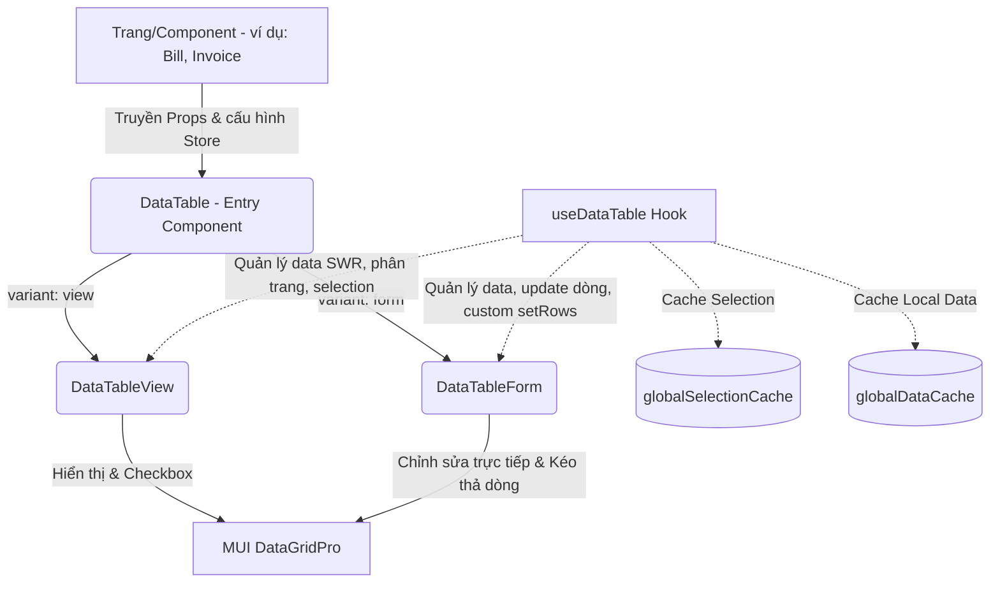

# Hướng dẫn & Kiến trúc DataTable (MUI DataGridPro)

Tài liệu này giải thích chi tiết kiến trúc, luồng hoạt động, cấu trúc logic và các quyết định kỹ thuật cốt lõi trong hệ thống `DataTable` của dự án. Hệ thống được thiết kế linh hoạt, hỗ trợ 2 chế độ hiển thị chính (View & Edit Form), tối ưu hóa trải nghiệm người dùng bằng bộ nhớ đệm (Cache) toàn cục và tải dữ liệu không đồng bộ (SWR/SWRInfinite).

---

## 1. Tổng quan Kiến trúc & Sơ đồ Luồng

Hệ thống `DataTable` được phân tách rõ ràng thành các lớp xử lý:



### Các thành phần chính:
1. **`DataTable` (Entry - [index.tsx](file:///Volumes/KINGSTON/Code/react-template/src/components/DataTable/index.tsx))**: Lớp bọc ngoài cùng (Wrapper), sử dụng `forwardRef` và `memo` để tối ưu render, điều hướng render giữa `DataTableView` và `DataTableForm` dựa vào prop `variant`.
2. **`useDataTable` (Hook - [useDataTable.ts](file:///Volumes/KINGSTON/Code/react-template/src/hooks/useDataTable.ts))**: Engine quản lý dữ liệu và state của bảng. Tích hợp thư viện `useSWR` để fetch dữ liệu từ server (chế độ `remote`) hoặc quản lý dữ liệu client-side (chế độ `local`).
3. **`DataTableView` (Viewer - [DataTableView/index.tsx](file:///Volumes/KINGSTON/Code/react-template/src/components/DataTable/DataTableView/index.tsx))**: Sử dụng cho giao diện danh sách chỉ xem (Read-only), hỗ trợ checkbox chọn nhiều dòng (Row Selection), phân trang tùy chỉnh (`Pagination`), ghim cột (`pinnedColumns`) và cột thao tác nhanh (`actionBars`).
4. **`DataTableForm` (Editor - [DataTableForm/index.tsx](file:///Volumes/KINGSTON/Code/react-template/src/components/DataTable/DataTableForm/index.tsx))**: Dành cho giao diện nhập liệu dạng lưới (Inline Grid Form). Hỗ trợ kéo thả sắp xếp lại dòng (Row Reordering), di chuyển nhanh giữa các ô bằng phím Tab/Shift+Tab, tự động thêm dòng mới khi bấm Tab ở ô cuối cùng, và tích hợp các bộ Editor tùy chỉnh cho từng loại dữ liệu.

---

## 2. Chi tiết Thiết kế Logic & Code

### 2.1 Custom Hook `useDataTable` (Quản lý State & Dữ liệu)

Hook `useDataTable` quản lý 3 mảng state cốt lõi: dữ liệu dòng (`rows`), tổng số lượng (`rowCount`), trạng thái tải (`loading`), phân trang (`paginationModel`), và trạng thái tick chọn (`rowSelectionModel`).

#### A. Giải quyết vấn đề mất State khi chuyển đổi Component (Global Cache)
Khi người dùng chuyển qua lại giữa các màn hình/tab hoặc phân trang dữ liệu, các component React sẽ bị unmount khiến state nội bộ bị mất. Để khắc phục điều này, `useDataTable` sử dụng 2 bộ nhớ đệm dạng `Map` độc lập ở cấp độ module (file-level):
```typescript
const globalSelectionCache = new Map<string, any>();
const globalDataCache = new Map<string, any>();
```
- **`globalSelectionCache`**: Lưu giữ trạng thái tick chọn checkbox (`rowSelectionModel`). MUI DataGridPro v9 yêu cầu cấu trúc `{ type: 'include' | 'exclude', ids: Set }`. Việc dùng `Map` toàn cục giúp tránh các lỗi so sánh sâu (Deep Equality) của SWR và giữ checkbox sáng đúng trạng thái khi quay lại bảng.
- **`globalDataCache`**: Lưu giữ dữ liệu tĩnh của bảng trong chế độ `local`, đảm bảo dữ liệu vừa chỉnh sửa không bị khôi phục lại giá trị gốc khi component re-render/re-mount.

#### B. Cấu hình SWR thông minh
```typescript
const { data: resData, isLoading, isValidating, mutate } = useSWR(
  key,
  fetcher,
  {
    revalidateOnFocus: false,
    revalidateIfStale: false,
    revalidateOnReconnect: false,
    keepPreviousData: true, // QUAN TRỌNG: Tránh chớp nháy giao diện
  }
);
```
- **`keepPreviousData: true`**: Khi chuyển trang, SWR giữ lại dữ liệu của trang trước đó và hiển thị hiệu ứng làm mờ nhẹ (loading indicator), thay vì xóa trắng bảng và vẽ lại từ đầu. Giúp giao diện mượt mà và liền mạch.
- **Tắt các cấu hình tự động revalidate**: Tránh việc tự động gọi API tải lại dữ liệu khi người dùng nhấp chuột ra ngoài trình duyệt rồi quay lại, bảo vệ hiệu năng hệ thống.

#### C. Hàm `setRows` đa năng
Hỗ trợ cập nhật trực tiếp dữ liệu trong bảng từ bên ngoài (cả ở dạng mảng mới hoặc callback nhận giá trị cũ `(prev) => newRows`):
- Ở chế độ `local`: Cập nhật `localStaticData` và ghi đè vào `globalDataCache`.
- Ở chế độ `remote`: Gọi `mutate` của SWR để cập nhật cache của trang hiện tại ngay lập tức (`mutate(newData, false)`), tối ưu trải nghiệm (Optimistic Update) không cần gọi lại API từ server.

---

### 2.2 `DataTableView` (Giao diện hiển thị danh sách)

#### A. Chuẩn hóa Selection Model
Khi checkbox thay đổi, MUI DataGridPro trả về mảng IDs hoặc một Selection Model tùy cấu hình. Để ngăn chặn lỗi crash ứng dụng do sai cấu trúc (như lỗi truy cập `.ids.size` trên mảng rỗng), `DataTableView` chuẩn hóa tất cả dữ liệu trả về trước khi lưu vào State/Cache:
```typescript
onRowSelectionModelChange={(params, details) => {
  if (props.rowSelectionModel === undefined) {
    let newModel: any;
    if (Array.isArray(params)) {
      newModel = { type: 'include', ids: new Set(params) };
    } else {
      newModel = { type: params?.type || 'include', ids: new Set(params?.ids || []) };
    }
    // Cập nhật local state hoặc store của hook
  }
}}
```
**Mẹo:** Việc bọc các IDs bằng `new Set(...)` tạo ra một tham chiếu vùng nhớ mới hoàn toàn. Điều này ép React phải nhận diện thay đổi và buộc bảng re-render ngay lập tức, khắc phục triệt để lỗi click checkbox nhưng không sáng.

#### B. Tự động Ghim cột (Pinned Columns)
Nếu bảng có cột checkbox (`checkboxSelection`) hoặc các nút hành động sửa/xóa (`actionBars`), `DataTableView` sẽ tự động cấu hình ghim:
- Cột checkbox (`__check__`) ghim bên trái (`left`).
- Cột actions (`actions`) ghim bên phải (`right`).
Giúp bảng khi cuộn ngang vẫn giữ được các thao tác cốt lõi.

---

### 2.3 `DataTableForm` (Bảng chỉnh sửa dữ liệu trực tiếp)

`DataTableForm` biến MUI DataGridPro thành một Excel-like Grid với các tính năng vượt trội:

#### A. Kéo thả dòng (Row Reordering)
Sử dụng thuộc tính `rowReordering` kết hợp sự kiện `onRowOrderChange`. Khi người dùng kéo thả dòng, hệ thống cập nhật lại chỉ mục (index) của dòng đó trong mảng dữ liệu, sau đó lưu trạng thái sắp xếp mới vào store thông qua `setRows`.

#### B. Di chuyển nhanh bằng phím Tab & Shift+Tab (`handleTabNavigation`)
Bảng ghi đè hành vi phím Tab mặc định của trình duyệt để tạo trải nghiệm nhập liệu chuyên nghiệp:
- Bấm **Tab**: Lưu giá trị hiện tại và chuyển quyền edit (Edit Mode) sang ô bên phải.
- Bấm **Shift + Tab**: Chuyển quyền edit sang ô bên trái.
- **Tự động thêm dòng mới (Auto Append)**: Khi con trỏ đang ở ô cuối cùng của dòng cuối cùng và người dùng bấm **Tab**, hệ thống tự động gọi hàm `addRowByTabKey()`, tạo một dòng mới với ID tự tăng, chèn vào bảng và chuyển con trỏ xuống ô đầu tiên của dòng mới này.
- **Bỏ qua ô Read-only**: Hệ thống duyệt qua danh sách `readOnlyCells` và tự động nhảy qua các ô không được phép sửa.

#### C. Quy trình Chỉnh sửa Ô (Cell Editing Flow)
Để tăng hiệu năng và tránh re-render toàn bộ grid lớn, bảng cấu hình `cellModesModel` để chỉ cho phép **tối đa một ô** được ở trạng thái chỉnh sửa tại một thời điểm:
1. Khi click vào ô (`onCellClick`), kiểm tra quyền editable và read-only.
2. Thiết lập trạng thái ô đó thành `GridCellModes.Edit`, đồng thời chuyển tất cả các ô khác về `GridCellModes.View`.
3. Sau khi chỉnh sửa xong (bấm Tab, Enter hoặc click ra ngoài), sự kiện `processRowUpdate` sẽ được kích hoạt để hợp nhất dữ liệu của dòng đó vào store thông qua `setRows`.

---

### 2.4 Editor Components tùy chỉnh (Cell Editors)

Nằm tại thư mục `src/components/DataTable/DataTableForm/components/`. Hệ thống tự động ghi đè thuộc tính `renderEditCell` của cột dựa trên loại dữ liệu (`type` trong `IGridColDef`):

1. **`CellEditText` (Mặc định & `textArea`)**:
   - Sử dụng MUI `<TextField>`.
   - Tự động gọi `focus()` và `select()` toàn bộ text khi kích hoạt để người dùng ghi đè nhanh.
   - Hỗ trợ nhập văn bản nhiều dòng (`multiline`) và tự động co giãn chiều cao dòng nếu `autoRowHeight = true`.

2. **`CellEditNumber` (`number` & `absNumber`)**:
   - Sử dụng thư viện `react-number-format` (`NumericFormat`) bọc ngoài MUI `TextField`.
   - Tự động định dạng số với dấu phân cách hàng nghìn (mặc định `,`) và chữ số thập phân (mặc định 2 số).
   - `isAbs` hoặc `absNumber`: Ngăn chặn hoặc tự động chuyển đổi số âm thành số dương.

3. **`CellEditAutocomplete` (`autocomplete`)**:
   - Tích hợp MUI `<Autocomplete>` hỗ trợ tìm kiếm trực quan.
   - **Lazy Loading & Infinite Scroll**: Sử dụng custom hook `useAutocomplete` (dựa trên `useSWRInfinite`). Khi người dùng cuộn danh sách xuống dưới cùng (`handleScroll`), hệ thống tự động tải thêm trang tiếp theo (Pagination Page Size mặc định là 7) và hiển thị mượt mà.
   - **Tối ưu tìm kiếm**: Chỉ kích hoạt tải từ xa (Remote Search) khi người dùng thực sự nhập text tìm kiếm, tránh spam request.
   - **Tìm kiếm ngược (Initial Value Resolution)**: Khi mở bảng chỉnh sửa, nếu ô đã có giá trị ID, component tự động gọi API tìm kiếm theo ID đó để lấy ra hiển thị nhãn văn bản tương ứng (Text Label), tránh việc hiển thị mã ID UUID thô kệch trên màn hình.

---

## 3. So sánh `useSWR` (DataTable) vs `useSWRInfinite` (Autocomplete)

Trong dự án, cả hai thành phần đều quản lý việc tải và cache dữ liệu, nhưng phục vụ 2 mô hình trải nghiệm người dùng khác nhau:

| Tiêu chí | `useDataTable` (DataTable) | `useAutocomplete` (Autocomplete) |
| :--- | :--- | :--- |
| **Thư viện** | `useSWR` | `useSWRInfinite` |
| **Cơ chế tải trang** | Thay thế toàn bộ dữ liệu trang cũ bằng dữ liệu trang mới (Page-by-page). | Tải thêm và nối tiếp dữ liệu mới vào cuối danh sách cũ (Infinite appending). |
| **Trải nghiệm UI** | Bảng hiển thị cố định số lượng dòng. Lật trang (Phân trang) sẽ tải trang cụ thể. | Dropdown danh sách. Cuộn xuống cuối cùng để tải thêm dòng mới. |
| **Cấu trúc dữ liệu cache** | Mảng 1 chiều chứa danh sách dòng: `[Row1, Row2, ...]` | Mảng 2 chiều đại diện cho từng trang: `[[Page1Rows], [Page2Rows], ...]` sau đó dùng `.flat()` để hiển thị. |
| **Tối ưu hóa UI** | Dùng `keepPreviousData: true` để tránh giật hình khi lật trang. | Dùng `persistSize: true` và check độ dài của trang cuối để xác định xem còn dữ liệu tải tiếp (`hasMore`) hay không. |

---

## 4. Các lưu ý quan trọng khi phát triển mới

> [!IMPORTANT]
> - **Luôn dùng Set mới cho Selection Model**: Khi cập nhật checkbox, bắt buộc phải sao chép qua `new Set()` để thay đổi tham chiếu, nếu không giao diện checkbox sẽ bị đơ không phản hồi click.
> - **Xử lý phím Tab trong Cell Editor**: Khi tạo một Cell Editor tùy chỉnh mới, hãy nhớ truyền hàm `onTabNavigation` vào sự kiện `onKeyDown` của component nhập liệu để không làm gãy luồng di chuyển nhanh bằng phím Tab của grid.
> - **Cache Key duy nhất**: Khi gọi `useDataTable` hay `DataTable` có `store`, hãy đảm bảo `cacheKey` là duy nhất giữa các bảng để tránh tình trạng dữ liệu bảng này ghi đè lên checkbox hoặc dữ liệu của bảng kia.
